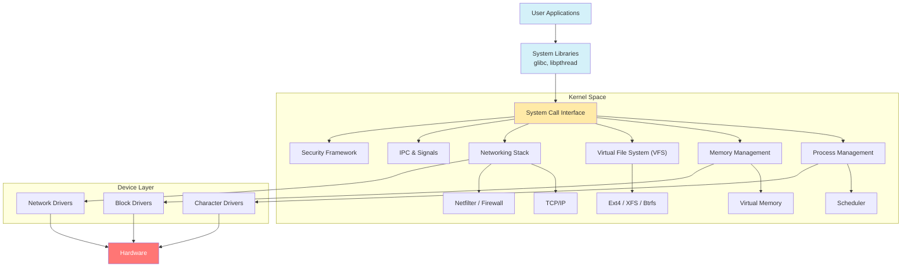

```mermaid
flowchart TD
    A[User Applications] --> B["System Libraries<br/>glibc, libpthread"]
    B --> C[System Call Interface]

    subgraph Kernel Space
        C --> D[Process Management]
        C --> E[Memory Management]
        C --> F["Virtual File System (VFS)"]
        C --> G[Networking Stack]
        C --> H[IPC & Signals]
        C --> I[Security Framework]

        F --> J[Ext4 / XFS / Btrfs]
        G --> K[TCP/IP]
        G --> L[Netfilter / Firewall]

        D --> M[Scheduler]
        E --> N[Virtual Memory]
    end

    subgraph Device Layer
        O[Character Drivers]
        P[Block Drivers]
        Q[Network Drivers]
    end

    D --> O
    E --> P
    G --> Q

    O --> R[Hardware]
    P --> R
    Q --> R

    style A fill:#d4f1f9
    style B fill:#d4f1f9
    style C fill:#ffeaa7
    style R fill:#ff7675,color:#fff
```

# Awesome Linux Internals Resources

